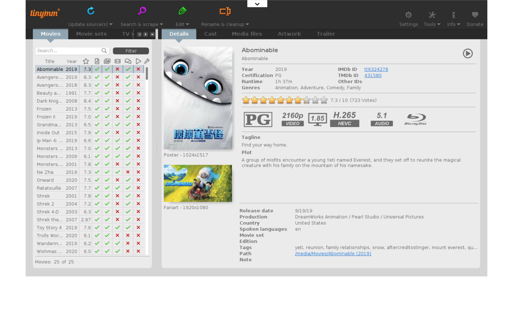
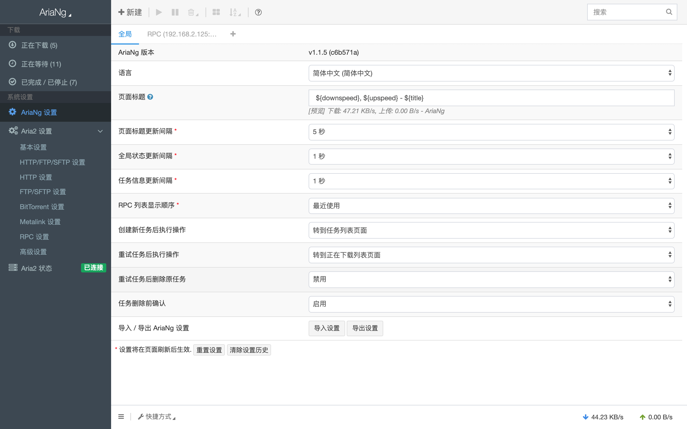
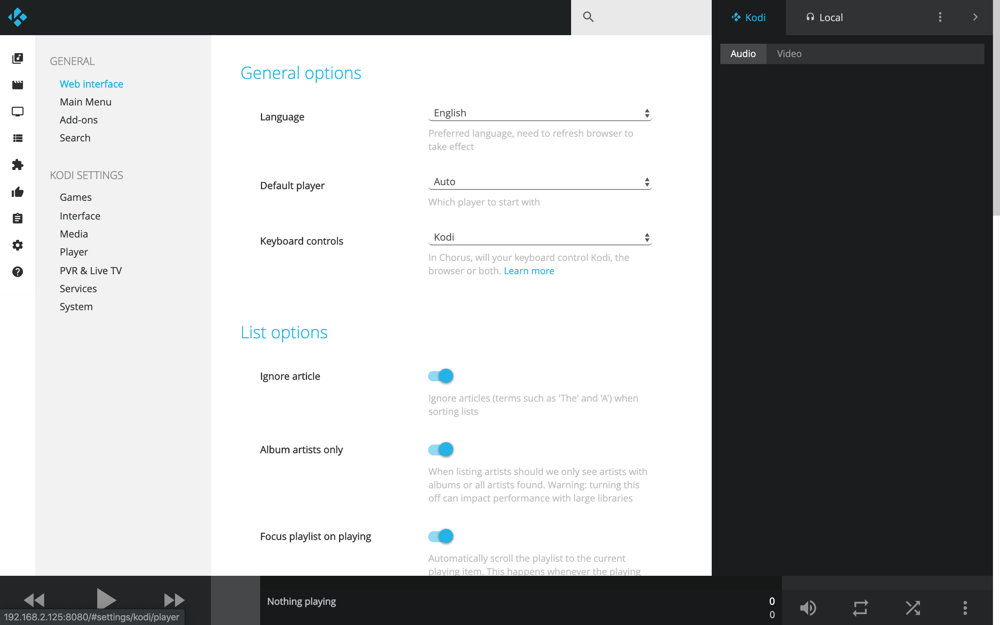
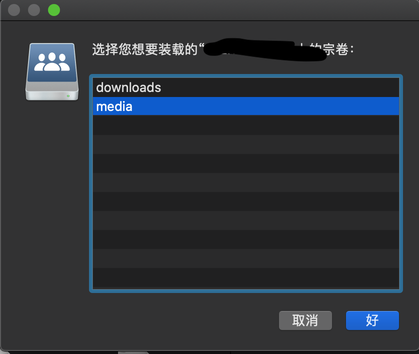

[toc]
## 智能家庭中心

使用`docker-compose`, 在废旧电脑上一键搭建智能家庭服务。

### 使用方法

#### 下载本仓库
```bash
$ git clone https://github.com/crazygit/family-media-center.git
$ cd family-media-center
```

#### 编辑配置文件

##### 编辑`run.sh`

根据自身情况修改`run.sh`脚本中的配置项

设置你的Aria2的RPC密码

``` bash
export ARIA2_PRC_SECRET="your_secret"
```

选择要启动的服务，默认启动全部服务

```
docker-compose -f docker-compose.aria2.yml \
               -f docker-compose.jellyfin.yml \
               -f docker-compose.kodi.yml \
               -f docker-compose.openwrt.yml \
               -f docker-compose.samba.yml \
               -f docker-compose.tiny_media_manager.yml \
               -f docker-compose.watchtower.yml \
               $@
```

##### 修改`openwrt`相关配置

如果要使用`openwrt`旁路由，请根据自身网络情况做如下调整:

1. 修改openwrt的配置文件`openwrt/etc/config/network`

    ```bash
    config interface 'lan'
            #option type 'bridge'
            option ifname 'eth0'
            option proto 'static'
            # 分配给openwrt系统的IP地址
            option ipaddr '192.168.2.126'
            # 子网掩码
            option netmask '255.255.255.0'
            # 主路由的网关
            option gateway '192.168.2.1'
            # DNS
            option dns '223.6.6.6'
            # 广播地址
            option broadcast '192.168.2.255'
            #option ip6assign '60'
    ```


2. 修改`docker-compose.openwrt.yml`

   注意: 宿主机如果通过WIFI连接网络，则选择ipvlan模式，如果是有线连接网络则选择macvlan模式
    ```bash
    networks:
      ipvlan:
        driver: ipvlan
        driver_opts:
          ipvlan_mode: l2
          # 宿主机网卡
          parent: enp3s0
        ipam:
          config:
              # 本地IP网段
            - subnet: 192.168.2.0/24
              #gateway: 192.168.2.1
    ```

### 运行

```bash
# 启动所有服务
$ bash run.sh up -d

# 停止所有服务
$ bash run.sh down
```

### 服务访问方式

* jellyfin

  <http://yourt_ip:8096>
* tiny_media_manager

  <http://yourt_ip:5800>
* aria_ng

  <http://yourt_ip:8800>
* kodi

  <http://yourt_ip:8080>

  默认用户名和密码都是`kodi`

* OpenWrt

  <http://your_openwrt_static_ip>

  默认用户名和密码分布为`root`和`password`

* samba服务
   * aria2下载目: <smb://your_ip/downloads>
   * jellyfin媒体目录: <smb://your_ip/media>

* watchtower

  每隔一个小时检查所有的docker镜像是否有新版本并且自动更新


### 资源推荐

`OpenWrt`建议安装

<https://github.com/frainzy1477/luci-app-clash/>

它包含一个`富强`软件和一个比较漂亮的主题


### 效果图

Jellyfin


TidyMediaManager



AriaNg



Kodi



Samba




